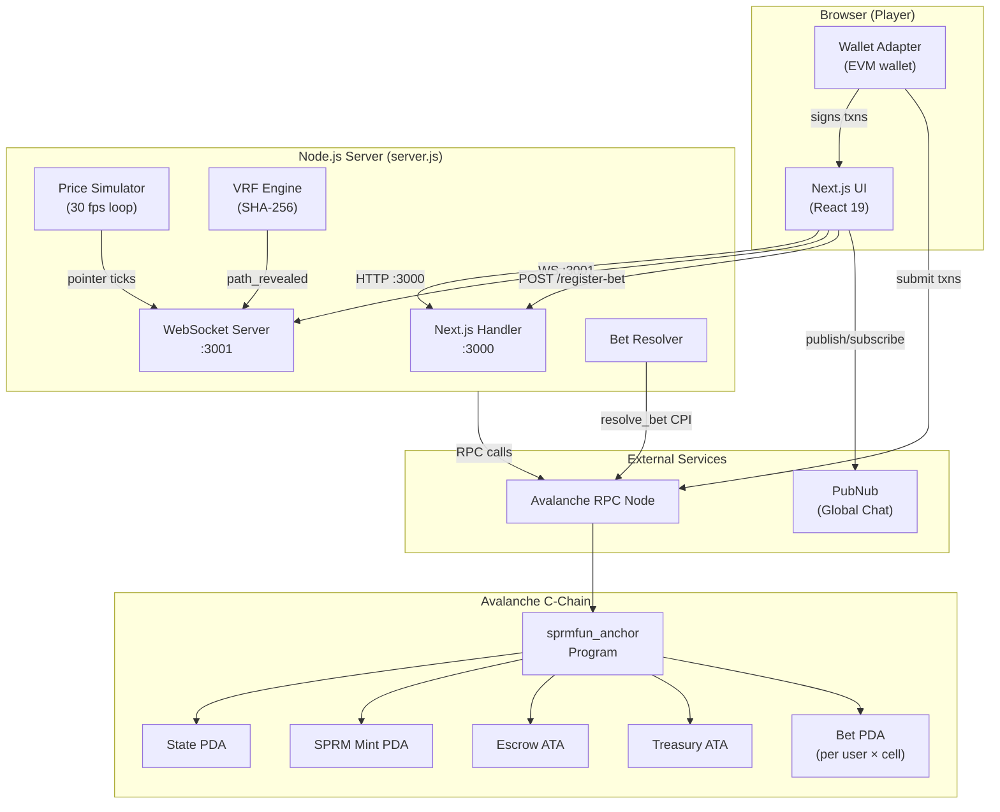
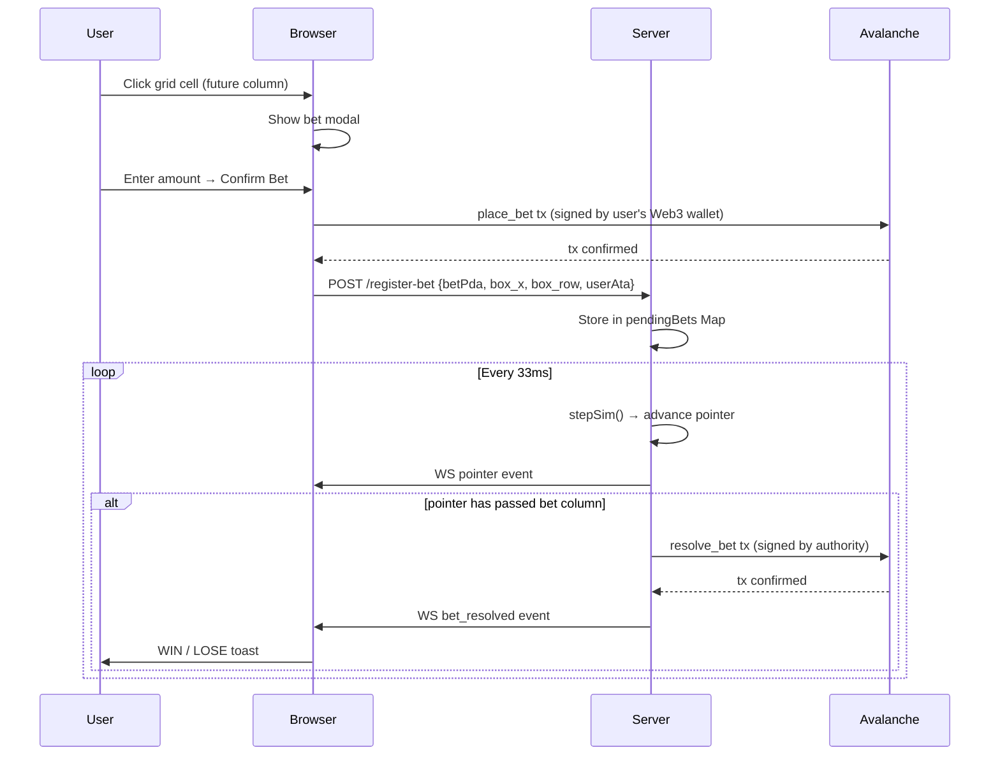
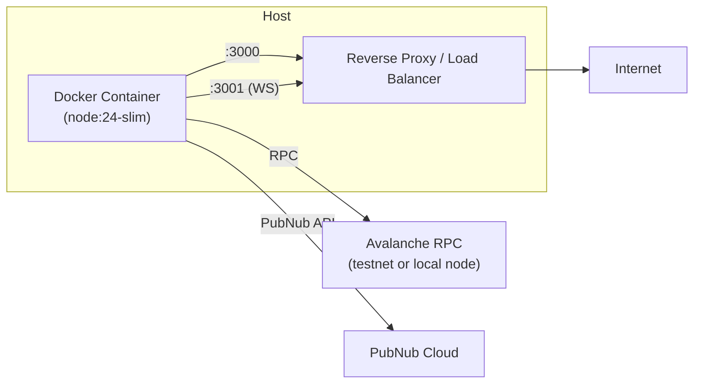

# System Architecture

This document describes the high-level system architecture of SPRMFUN — how the major runtime processes and external services relate to each other.

---

## Component Overview

---

## Runtime Processes

### Next.js HTTP Server (port 3000)

Serves the compiled Next.js application and exposes two API routes:

| Route | Method | Description |
|---|---|---|
| `/api/idl` | GET | Returns the compiled contract ABI/metadata as JSON |
| `/api/airdrop` | POST | Requests AVAX tokens from the local faucet for the given wallet |
| `/register-bet` | POST | Registers a confirmed on-chain bet for server-side resolution |

### WebSocket Game Server (port 3001)

Maintains a live simulation loop that runs at ~30 fps (every 33 ms). On each tick it:

1. Advances the simulated price (`stepSim`)
2. Steers the pointer toward the VRF-determined winning row
3. Broadcasts a `pointer` message to all connected clients
4. Checks whether any pending bets can now be resolved (pointer has passed the bet's column)
5. Triggers `refreshVrf` when due

Every 3 seconds it broadcasts new `grid` columns to keep the look-ahead buffer full.

### Avalanche Contract (on-chain)

A Solidity contract deployed on the Avalanche C‑Chain. All token custody, bet lifecycle, and payout arithmetic happen on-chain. The server acts as the trusted **authority** that posts VRF results and resolves bets.

---

## Data Flow — Bet Lifecycle

---

## Infrastructure Topology

> **Assumption**: A reverse proxy (e.g. nginx or Caddy) fronts both ports in production. The Dockerfile exposes `3000` and `3001`. Actual proxy configuration is not present in this repository.

---

## Key Design Constraints

| Constraint | Value |
|---|---|
| Grid column width | 140 px |
| Rows per column | 10 |
| Pointer broadcast rate | ~30 fps (33 ms interval) |
| Grid look-ahead | 25 columns |
| History buffer size | 4 000 points (client) / 2 800 points (server) |
| VRF refresh period | Every 8 columns (~37 s at default speed) |
| Max column memory (client) | 300 columns |
| Token decimals | 9 |
| House edge | 200 bps (2 %) — set at initialisation |
