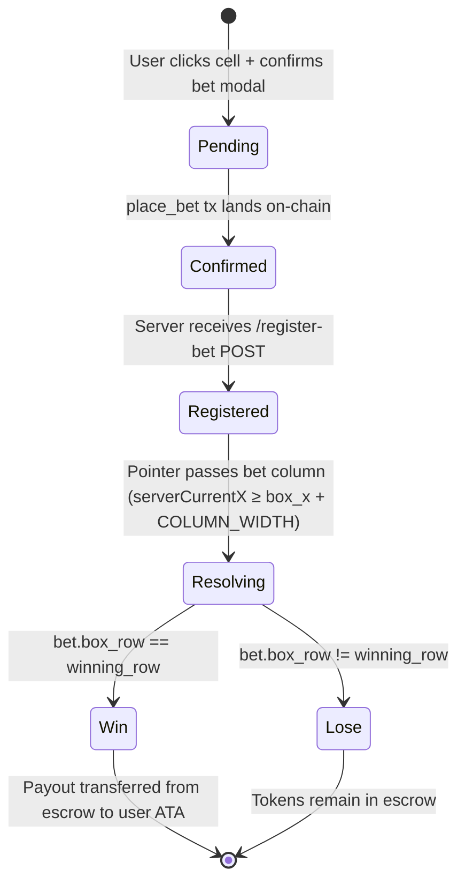
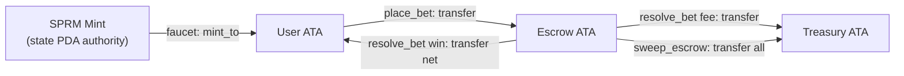

# System Design

This document covers the key design decisions in SPRMFUN: the grid model, the VRF-based randomness scheme, the betting and payout model, and token economics.

---

## Grid Model

### Layout

The game world is a horizontally scrolling grid of **columns** and **rows**.

| Constant | Value | Meaning |
|---|---|---|
| `COLUMN_WIDTH` | 140 px | Width of each grid column |
| `ROW_COUNT` | 10 | Number of rows per column |
| `POINTER_LEFT_FRAC` | 0.30 | Pointer is rendered 30 % from the right edge |
| `MAX_HISTORY` | 4 000 (client) / 2 800 (server) | Max pointer path points kept in memory |

### Multiplier Table

Row 0 is the bottom row (lowest risk, lowest reward). Row 9 is the top row (highest risk, highest reward).

| Row | Display multiplier | Numerator | Denominator | Net (after 2 % fee) |
|---|---|---|---|---|
| 0 | 0.10× | 1 | 10 | 0.098× |
| 1 | 0.25× | 1 | 4 | 0.245× |
| 2 | 0.50× | 1 | 2 | 0.490× |
| 3 | 0.75× | 3 | 4 | 0.735× |
| 4 | 1.00× | 1 | 1 | 0.980× |
| 5 | 1.50× | 3 | 2 | 1.470× |
| 6 | 2.00× | 2 | 1 | 1.960× |
| 7 | 3.00× | 3 | 1 | 2.940× |
| 8 | 5.00× | 5 | 1 | 4.900× |
| 9 | 10.0× | 10 | 1 | 9.800× |

The on-chain payout is computed as `amount * MULT_NUM[row] / MULT_DEN[row]`, then the house fee is deducted: `fee = gross * house_edge_bps / 10_000`.

---

## Price Simulation

The pointer's vertical position (`simY`, 0 = top, 1 = bottom) evolves as a bounded random walk:

```
simVelocity = simVelocity * 0.95           // damping
            + (random - 0.5) * 0.012       // noise
            + sin(t * 0.008) * 0.0003      // slow sinusoidal trend
            + shock                         // random shock (1.5% prob, ±0.03)

simVelocity = clamp(simVelocity, -0.012, 0.012)
simY       += simVelocity
simY       += (0.5 - simY) * 0.002        // mean-reversion toward 0.5
simY        = clamp(simY, 0.05, 0.95)
```

### VRF Steering

Before the simulation step, the server calls `steerTowardRow` to nudge the pointer toward the VRF-determined winning row. The urgency increases as the pointer approaches the end of the column:

```
urgency = clamp(|diff| / (pxLeft / COLUMN_WIDTH), 0.01, 0.15)
simVelocity += diff * urgency * 0.5
```

This ensures the pointer naturally lands near the winning row without a jarring teleport.

---

## VRF Randomness Design

> **Note**: The current implementation uses a server-controlled pseudo-VRF. A true on-chain VRF oracle (e.g. MagicBlock) is referenced in the code comments but is not connected in this repository.

### How winning rows are determined

1. Every `VRF_REFRESH_COLS` (8) columns, the server generates a new 32-byte `vrfResult` and 32-byte `serverSalt` using `crypto.randomBytes(32)`.
2. For each of the next 8 columns, the winning row is:

```
winningRow(colX) = sha256(vrfResult || serverSalt || colX_as_LE_int64)[0] % 10
```

3. These rows are stored in `vrfPath` (server-side) and broadcast as `path_revealed` events.
4. The authority calls `consume_vrf(vrfResult, serverSalt)` on-chain to commit the randomness.

### On-chain VRF state

The `State` account holds:

| Field | Type | Description |
|---|---|---|
| `vrf_result` | `[u8; 32]` | Latest 32-byte randomness |
| `seed_salt` | `[u8; 32]` | Server-provided salt |
| `seed_index` | `u64` | Increments with every `consume_vrf` call |
| `seed_updated_at` | `i64` | Unix timestamp of last update |

### VRF refresh schedule

```mermaid
gantt
    title VRF refresh cycle (8 columns × 140 px × 33 ms/px ≈ 37 s)
    dateFormat X
    axisFormat %s s

    section VRF batch 1
    Columns 0-7 :0, 37
    section VRF batch 2
    Columns 8-15 :37, 74
    section VRF batch 3
    Columns 16-23 :74, 111
```



The server triggers a new refresh when `(curColX - lastVrfColX) / COLUMN_WIDTH >= VRF_REFRESH_COLS - 2` (i.e. 2 columns before exhaustion), giving the `consume_vrf` transaction time to land.

---

## Bet Lifecycle



### Bet PDA Seed

```
seeds = [b"bet", user_pubkey, box_x_as_LE_int64, box_row_as_u8]
```

This makes each (user, column, row) combination a unique, deterministic account. A user cannot place two bets on the same cell.

### Win condition

The server tracks the full row range the pointer traversed in each column (`columnRowRange: Map<colX, {minRow, maxRow}>`). A bet wins if `betRow >= minRow && betRow <= maxRow`.

The `resolve_bet` instruction receives the `winning_row` parameter from the authority. The authority chooses `winning_row = betRow` if the bet wins, or any other row if it loses.

---

## Token Economics

| Parameter | Value |
|---|---|
| Token symbol | SPRM |
| Decimals | 9 |
| `ONE_TOKEN` | 10⁹ lamports |
| House edge | 200 bps (2 %) |
| Faucet amount (UI) | 5 SPRM |
| Min bet (UI validation) | > 0 SPRM |

### Token flow



### Escrow invariant

All tokens in the escrow either:
- Belong to a pending bet (locked until resolution), or
- Are house reserve (pre-funded via `scripts/prefund-escrow.js`)

The `sweep_escrow` instruction lets the admin drain the escrow to the treasury (e.g. for accounting or rebalancing).

---

## Security Considerations

| Risk | Mitigation |
|---|---|
| Authority key compromise | All `resolve_bet` and `consume_vrf` calls require the authority's signature. The keypair is never baked into Docker images — mounted at runtime via volume. |
| Double-resolve | `resolve_bet` checks `require!(!bet.resolved, AlreadyResolved)` on-chain. |
| Row out of bounds | `require!(box_row < ROW_COUNT)` and `require!(winning_row < ROW_COUNT)` enforced on-chain. |
| Zero-amount bets | `require!(amount > 0, ZeroBet)` enforced on-chain. |
| House edge cap | `require!(house_edge_bps <= 5_000)` — cannot exceed 50 %. |
| Overflow | All arithmetic uses `checked_mul` / `checked_div` / `checked_add`. |
| Server-side VRF trust | **Assumption**: The current VRF is server-controlled. Players must trust the server. Upgrading to a decentralised VRF oracle would remove this trust assumption. |
| PubNub key exposure | PubNub publish/subscribe keys are `NEXT_PUBLIC_*` and therefore visible in the browser bundle. This is expected for PubNub's browser-facing SDK pattern. |
