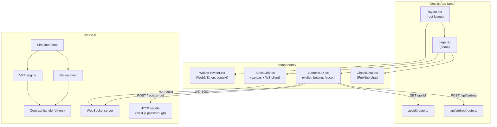
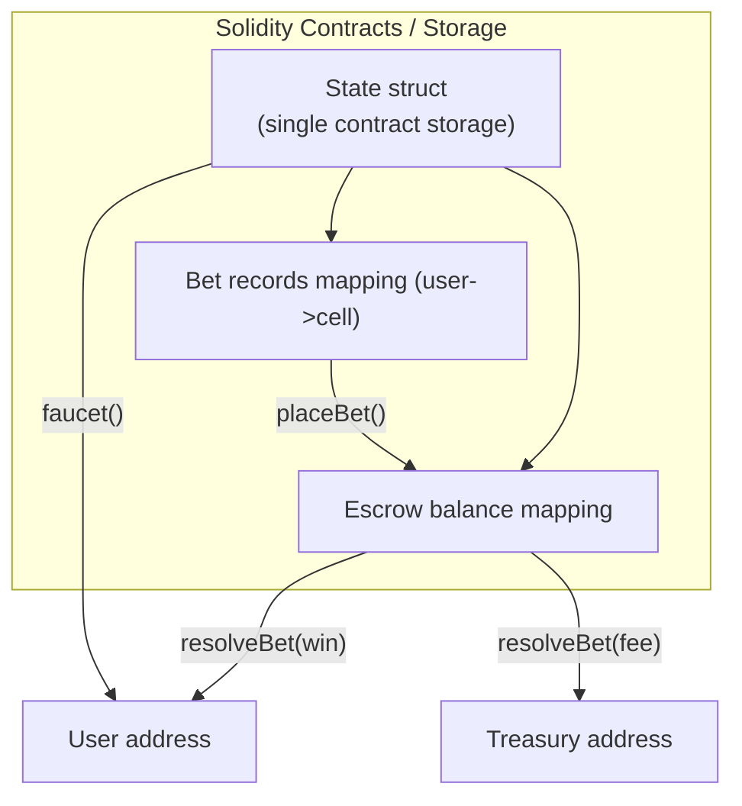
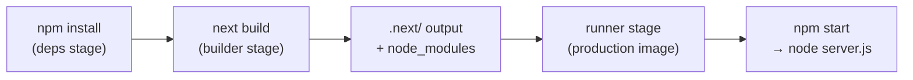
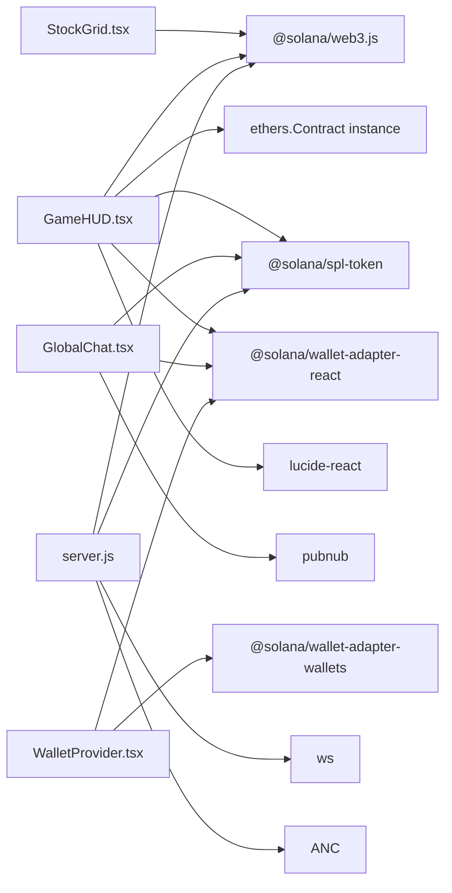

# Technical Architecture

This document describes the technical stack, inter-process communication, module boundaries, and key implementation choices in SPRMFUN.

---

## Technology Stack

| Concern | Technology | Version | Notes |
|---|---|---|---|
| Frontend framework | Next.js | ^16.1.6 | App Router; React 19 |
| Language (frontend) | TypeScript | ^5 | Strict mode |
| Rendering | HTML5 Canvas | — | No UI library; raw 2D context |
| Blockchain SDK | `ethers` | ^6 | Handles contract interactions, provider abstraction |
| Avalanche web3 | `ethers` | ^6 | RPC connection to Avalanche C‑Chain |
| Token library | `@openzeppelin/contracts` | ^4 | Standard ERC‑20 helpers used in solidity contracts |
| Wallet adapter | `@web3-react` / `ethers` | various | MetaMask or other EVM-compatible wallets |
| Real-time transport | `ws` | ^8.18.0 | Node.js WebSocket server |
| Chat | PubNub | ^10.2.7 | Browser SDK |
| Smart contract | Solidity | ^0.8 | Deployed to Avalanche C‑Chain; interfaces via `ethers` |
| Icons | `lucide-react` | ^0.575.0 | `Volume2`, `VolumeX`, `MessageSquare`, `Send`, `X` |
| Config | `dotenv` | ^17.3.1 | Loaded in `server.js` |
| Containerisation | Docker | — | Multi-stage (`deps` → `builder` → `runner`) |

---

## Module Map

---

## Server Architecture (`server.js`)

`server.js` is a monolithic Node.js entry point that:

1. Loads environment variables via `dotenv`
2. Prepares the Next.js application (`app.prepare()`)
3. Starts an HTTP server on **port 3000** that:
   - Handles `POST /register-bet` directly (no Next.js routing)
   - Passes all other requests to the Next.js request handler
4. Starts a separate HTTP server on **port 3001** exclusively for the WebSocket upgrade

### Timer Loops

| Loop | Interval | Purpose |
|---|---|---|
| Pointer broadcast | 33 ms | Advance simulation, broadcast pointer, resolve bets, trigger VRF refresh |
| Grid broadcast | 3 000 ms | Emit 5 new grid columns when look-ahead drops below 25 columns |

### In-Memory State

| Variable | Type | Description |
|---|---|---|
| `historyBuffer` | `Array` (max 2 800) | Recent pointer positions `{x, y, multiplier}` |
| `allColumns` | `Array` (max 300) | All generated grid columns |
| `clients` | `Set<WebSocket>` | Currently connected browser clients |
| `pendingBets` | `Map<betPdaStr, BetInfo>` | Bets awaiting resolution |
| `vrfPath` | `Map<colX, {row, vrfResult, serverSalt}>` | Pre-computed winning rows |
| `columnRowRange` | `Map<colX, {minRow, maxRow}>` | Row range pointer traversed per column |
| `serverCurrentX` | `number` | Current pointer X position in pixels |

---

## WebSocket Message Protocol

All messages are JSON strings.

### Server → Client

| `type` | Fields | Description |
|---|---|---|
| `init` | `columns`, `history`, `currentX` | Full state snapshot sent on connect |
| `pointer` | `y`, `multiplier`, `currentX`, `timestamp` | Per-tick pointer position |
| `grid` | `columns` | Batch of new grid columns |
| `vrf_state` | `paths[]` (`{colX, row}`), `seedIndex` | Known VRF paths for newly connected client |
| `path_revealed` | `paths[]` (`{colX, row}`), `seedIndex` | New VRF paths after a refresh |
| `bet_resolved` | `betPda`, `user`, `box_x`, `box_row`, `winning_row`, `won` | On-chain bet resolution result |

### Client → Server (WebSocket)

| `type` | Fields | Description |
|---|---|---|
| `register_bet` | `betPda`, `user`, `box_x`, `box_row`, `userAta` | Registers a confirmed bet for server-side watch |

### Client → Server (HTTP)

| Route | Method | Body | Description |
|---|---|---|---|
| `/register-bet` | POST | `{betPda, user, box_x, box_row, userAta}` | Same as WS `register_bet` but over HTTP |

---

## Frontend Component Architecture

### StockGrid

- Pure canvas component; no DOM elements except one `
` and one `<canvas>`
- All mutable state lives in a single `useRef` (`state.current`) to avoid React re-renders during the animation loop
- Two separate `useEffect` hooks: one for the WebSocket connection + animation loop, one for mouse event listeners
- Custom events (`sprmfun:select`, `sprmfun:deselect`) are used to communicate between `StockGrid` and `GameHUD` without shared state or prop drilling

### GameHUD

- Overlays the canvas with `pointer-events: none` except for interactive controls
- Manages the Ethers `Contract` instance after wallet connection
- Maintains a second WebSocket connection (independent of `StockGrid`) for sending `register_bet`
- Implements transaction retry logic: resends serialised transactions every 2 s while polling for confirmation (up to 40 attempts / ~40 s)

### GlobalChat

- Connects to PubNub on mount; fetches the last 25 messages via `fetchMessages`
- Lazy-loads SPRM token balances on sender hover via `getTokenAccountBalance`
- Chat is silently hidden when PubNub keys are not set

### WalletProvider

- Wraps the tree in an Ethers `Web3Provider` context
- Expects a generic EVM‑compatible wallet (MetaMask default)
- RPC endpoint is configurable via `NEXT_PUBLIC_RPC_URL`

---

## On‑chain Contract Architecture

### Contract Storage Layout

| Item | Type | Description |
|---|---|---|
| `state` | struct | global parameters (vrf, house edge, mint) |
| `bets[user][col][row]` | struct | individual bet records with amount, resolved flag |
| `escrowBalance` | uint256 | tokens held pending resolution or house reserve |

---

## Build Pipeline

The `builder` stage sets `NEXT_PUBLIC_*` environment variables so they are baked into the static bundle. Server-side secrets (`ANCHOR_WALLET`, `ANCHOR_PROVIDER_URL`) are **not** baked — they must be supplied at runtime. (these variables are legacy but still used for RPC/auth configuration)

---

## Dependency Graph (key packages)

