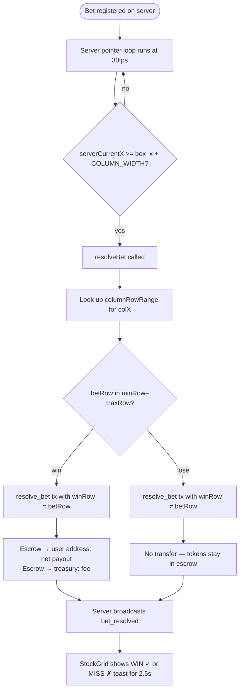

# User Flow

This document describes the key user journeys in SPRMFUN, from first visit through placing and resolving a bet.

---

## Journey 1 — First Visit (No Wallet)

```mermaid
flowchart TD
    A([Open SPRMFUN in browser]) --> B[StockGrid canvas renders]
    B --> C[WebSocket connects to :3001]
    C --> D[Server sends init message:\ncolumns + history + currentX]
    D --> E[Grid animates at ~30 fps]
    E --> F{User tries to click a cell}
    F --> G["'Connect wallet to place bets'\nbanner visible at bottom"]
    G --> H[User clicks wallet button top-right]
    H --> I[Wallet modal opens (MetaMask/RainbowKit)]
    I --> J[User approves connection]
    J --> K[Wallet connected → GameHUD shows balance]
```

---

## Journey 2 — Claim Tokens (Faucet)

```mermaid
flowchart TD
    A([Wallet connected, balance < 2 SPRM]) --> B["'+ GET TOKENS' button visible in balance pill"]
    B --> C[User clicks GET TOKENS]
    C --> D{AVAX balance < 0.01?}
    D -- yes --> E[POST /api/airdrop → 1 AVAX transferred]
    D -- no --> F[Skip airdrop]
    E --> F
    F --> G[Build faucet tx via ethers:\nfaucet(5 × ONE_TOKEN)]
    G --> H[Wallet prompts user to sign]
    H --> I[Tx sent to Avalanche RPC]
    I --> J[Poll confirmation every 1s\nmax 40 attempts]
    J --> K{Confirmed?}
    K -- yes --> L[fetchBalance → UI updates to 5.00 SPRM]
    K -- no --> M[alert: 'Faucet not confirmed']
```

---

## Journey 3 — Placing a Bet (Standard Modal)

```mermaid
flowchart TD
    A([Wallet connected, balance > 0]) --> B[User hovers over a future column cell]
    B --> C[Cell highlights cyan with multiplier label]
    C --> D[User clicks the cell]
    D --> E[StockGrid dispatches\n'sprmfun:select' CustomEvent]
    E --> F[GameHUD receives event]
    F --> G{Quick Bet enabled?}
    G -- no --> H[Bet modal opens:\nshows colX, row, multiplier, net payout]
    G -- yes --> I[Bet fires immediately with preset amount]
    H --> J[User adjusts amount or picks preset: 0.5/1/2/5]
    J --> K[User clicks CONFIRM BET]
    K --> L[Build place_bet tx via ethers contract]
    L --> M[Wallet signs tx]
    M --> N[sendRawTransaction to RPC\n(no preflight, retries handled manually)]
    N --> O[Resend every 2s while polling]
    O --> P{Confirmed?}
    P -- yes --> Q[POST /register-bet to server]
    Q --> R[Cell turns green 'pending']
    P -- no --> S[Show error in modal: 'Bet not confirmed']
```

---

## Journey 4 — Bet Resolution



---

## Journey 5 — Global Chat

```mermaid
flowchart TD
    A([User clicks chat bubble bottom-left]) --> B[Chat panel opens]
    B --> C[PubNub subscribes to 'sprmfun-global-chat']
    C --> D[Last 25 messages fetched]
    D --> E[Messages rendered in panel]
    E --> F{User connected?}
    F -- yes --> G[User types message → Submit]
    F -- no --> H[Input available but sender shown as 'Anon']
    G --> I[pubnub.publish:\n{text, sender: short addr, fullSender: full address}]
    I --> J[All subscribers receive message in real time]
    J --> K[User hovers sender name]
    K --> L[Fetch SPRM balance via getTokenBalance]
    L --> M[Tooltip shows balance or 'No SPRM account']
```

---

## Journey 6 — Quick Bet Mode

```mermaid
flowchart TD
    A([Connected user opens side panel]) --> B["Set DEFAULT AMOUNT (e.g. 1 SPRM)"]
    B --> C[Toggle QUICK BET on]
    C --> D[User clicks any future cell]
    D --> E[sprmfun:select event fires]
    E --> F[GameHUD sets pendingBet immediately]
    F --> G[handlePlaceBet fires automatically\n(no modal shown)]
    G --> H[Same tx flow as Journey 3 — K onwards]
```

---

## Screen Layout

```
┌─────────────────────────────────────────────────────────────┐
│  SPRMFUN  LIVE GRID      [mult]×                  ● LIVE    │  ← Header bar (canvas)
├─────────────────────────────────────────────────────────────┤
│                                                             │
│  [BET SETTINGS]   ┌─────────────────────────────────────┐  │
│  panel (left)     │  Canvas: scrolling multiplier grid   │  │
│                   │  ← pointer path (pink line)          │  │
│                   │  ← yellow: pointer visited cells     │  │
│                   │  ← green:  pending bet cells         │  │
│                   └─────────────────────────────────────┘  │
│                                                             │
│  [💬]                    [WIN ✓ / MISS ✗ toast]            │
└─────────────────────────────────────────────────────────────┘
                    top-right: BAL pill + wallet button
```

---

## State Transitions — Cell Appearance

| State | Fill | Border | Text colour | Condition |
|---|---|---|---|---|
| Normal (past/current) | transparent | none | dim purple | Default |
| Normal (future / selectable) | transparent | none | cyan 55 % | `colX > curColX` |
| Hovered (selectable) | cyan 18 % | cyan 80 % | cyan 95 % | Mouse over + selectable |
| Visited by pointer | yellow 75 % | yellow 80 % | dark | Pointer row range |
| Active pointer row | bright yellow 100 % | #ffff00 | black bold | Exact current row |
| Pending bet | green 32 % | #00ff88 | #00ff88 bold | `result === 'pending'` |
| Win flash | green 50 % | green 100 % | — | `result === 'win'` (2.5 s) |
| Lose flash | red 40 % | red 100 % | — | `result === 'lose'` (2.5 s) |
